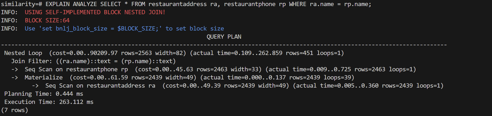
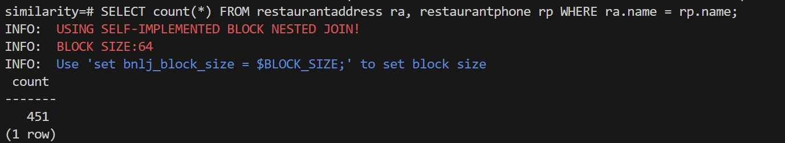
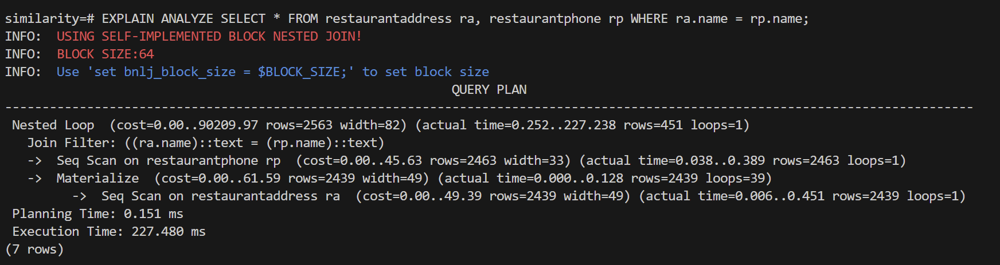

# 实验报告：PostgreSQL中Block Nested Loop Join的实现

**作者：23307140019 张子程**
**日期：2025年6月21日**

## 1. 摘要

本报告详细描述了成功修改PostgreSQL的nodeNestloop.c执行器节点以实现基于块的嵌套循环连接(BNLJ)算法。通过课本，我们知道标准嵌套循环连接(NLJ)存在显著的I/O效率问题，因为它需要对外部关系的每个元组进行内部关系的完整扫描。我完全重写了nodeNestLoopJoin，比原实现更简洁，保持了inner join的功能正确（join后的条数正确）。实测在block size=1时（BNLJ退化成NLJ）也有效率提升。观察到随着块增大，耗时逐渐减小。不过我个人认为这个提升和减少从磁盘到内存的读入没啥关系（因为现代计算机的内存能非常轻松的装下两张完整的表 不可能发生内存块的替换），主要影响因素应该是块越大，内层数据的访问密集性越高，CPU的L1 L2缓存命中率越高。完整代码见github仓库：https://github.com/victkk/Postgres-Block-Nested-Join.git

## 2. 经验


1. wsl2+openssh+vscode比较舒适，和在win主机上使用vscode体验一致
2. 为了保证调用自己的BNLJ并模拟上个世纪的电脑可以设置（如果调用了BNLJ大概在几百ms，如果几ms说明用了别的join方式）：
```bash
set enable_hashjoin=false;
set enable_mergejoin=false;
SET enable_material = false;
SET work_mem = '64kB';
```
3. 可以用EXPLAIN ANALYZE查看生成的查询计划
```sql
EXPLAIN ANALYZE SELECT count(*) FROM restaurantaddress ra, restaurantphone rp WHERE ra.name = rp.name;
```


4. 编译+重新启动服务器可以用：
```bash
make && make install && $HOME/pgsql/bin/pg_ctl stop -D $HOME/pgsql/data && $HOME/pgsql/bin/pg_ctl start -D $HOME/pgsql/data && $HOME/pgsql/bin/psql postgres
```

5. 可用elog输出一些中间结果到命令行
```c
elog(INFO, "\033[31mBLOCK SIZE:%d\033[0m",block_nested_loop_join_block_size);
```
代码上主要有几个需要注意的：
1. NestLoopState是按照迭代器模式实现的，每次查到一条匹配的就返回。select *的话会不断调用ExecNestLoop函数，所以得注意维护上次返回之前扫描到哪里了
2. ExecProcNode返回的槽是会被复用的，连着调用两次可能会返回同一个指针。所以必须为块创建空间，然后把ExecProcNode返回的槽指针指向的数据深度拷贝到块的空间里。
3. 边界条件比较搞 记得检查join返回的数值对不对，有可能只少两三条
4. 遇到了匹配下次怎么从同一个内层块和外层块的正确索引开始：我是把当前内层/外层块的索引存在NestLoopState里
5. 怎么判断是否取新块：我是嵌套的外层内层块for循环退出说明要取下一个innerBlock，当前innerBlock不满判断该取下一个outerBlock，outerBlock和innerBlock都不满说明可以结束了
## 3. 实现细节

实现涉及修改NestLoopState（`src/include/nodes/execnodes.h`）数据结构以及ExecInitNestLoop和ExecNestLoop和ExecEndNestLoop（`src/backend/executor/nodeNestloop.c`）。

### 3.1 数据结构修改(NestLoopState)

为了支持基于块的处理，NestLoopState结构增加了管理两个内存块（一个用于外部关系，一个用于内部关系）及其对应状态的字段。

```c
typedef struct NestLoopState
{
    JoinState   js;             /* 标准JoinState字段 */
    bool        nl_NeedNewOuter;/* 获取新外部块的标志 */
    bool        nl_NeedNewInner;/* 获取新内部块的标志 */

    /* --- 基于块的连接增加部分 --- */
    TupleTableSlot **outerBlock;    /* 外部元组的内存缓冲 */
    TupleTableSlot **innerBlock;    /* 内部元组的内存缓冲 */
    int         outerBlockSize;     /* 外部块中实际元组数量 */
    int         innerBlockSize;     /* 内部块中实际元组数量 */
    int         outerBlockIndex;    /* 外部块中当前元组索引 */
    int         innerBlockIndex;    /* 内部块中当前元组索引 */
} NestLoopState;
```

- **outerBlock/innerBlock**：这些是指向TupleTableSlots的指针数组，作为我们的内存缓冲区。
- **outerBlockSize/innerBlockSize**：这些跟踪加载到每个块中的实际元组数量，如果我们到达关系的末尾，这可能少于最大块大小。
- **outerBlockIndex/innerBlockIndex**：这些作为迭代器，指向每个块内正在处理的当前元组。

### 3.2 初始化(ExecInitNestLoop)

初始化函数被修改以为元组块分配内存。

**内存分配**：使用palloc0fast，我们分配两个TupleTableSlot*数组。这些数组的大小由block_nested_loop_join_block_size GUC（全局统一配置）变量确定，使块大小可在运行时配置。

```c
nlstate->outerBlock = (TupleTableSlot **)palloc0fast(block_nested_loop_join_block_size * sizeof(TupleTableSlot *));
nlstate->innerBlock = (TupleTableSlot **)palloc0fast(block_nested_loop_join_block_size * sizeof(TupleTableSlot *));
```

**元组槽初始化**：分配的数组只是指针。我们必须初始化每个元素成为有效的、可写的TupleTableSlot。这一点至关重要，因为子节点返回的槽通常是会被复用的，连着两次请求下一个数据可能返回的槽指针是同一个！所以我们必须为两个block创建实际的缓冲空间，构造block的时候把子节点的数据深度拷贝到缓冲空间里。

```c
for (int i = 0; i < block_nested_loop_join_block_size; i++) {
    nlstate->outerBlock[i] = ExecInitNullTupleSlot(...);
    nlstate->innerBlock[i] = ExecInitNullTupleSlot(...);
}
```

**状态初始化**：所有与块相关的计数器和标志（nl_NeedNewOuter、nl_NeedNewInner、索引和大小）都被初始化为其起始值。

### 3.3 核心执行逻辑(ExecNestLoop)

ExecNestLoop函数被完全重写以实现BNLJ算法，替换原来的逐元组逻辑。

主for (;;)循环现在协调块填充和块连接逻辑：

1. **填充外部块**：当nl_NeedNewOuter标志为true时，代码通过重复调用ExecProcNode(outerPlan)填充outerBlock与元组。它还重置内部计划扫描（ExecReScan(innerPlan)）以确保随后的内部块从内部关系的起始处读取。
```c
if (node->nl_NeedNewOuter)
		{
			ExecReScan(innerPlan);
			node->outerBlockSize = 0;
			node->outerBlockIndex = 0;
			ENL1_printf("getting new outer tuple");
			// elog(NOTICE, "getting New Outer");
			for(;node->outerBlockSize<block_nested_loop_join_block_size;node->outerBlockSize++){
				outerTupleSlot = ExecProcNode(outerPlan);
				if(!TupIsNull(outerTupleSlot))
					ExecCopySlot(node->outerBlock[node->outerBlockSize], outerTupleSlot);
				else
					break;				
			}
			node->nl_NeedNewOuter = false;
		}
```

2. **填充内部块**：当nl_NeedNewInner标志为true时，代码通过调用ExecProcNode(innerPlan)从内部关系填充innerBlock的下一块元组。
```c
if (node->nl_NeedNewInner)
		{
			node->innerBlockSize = 0;
			node->innerBlockIndex = 0;
			node->outerBlockIndex = 0;
			for(;node->innerBlockSize<block_nested_loop_join_block_size;node->innerBlockSize++){
				innerTupleSlot = ExecProcNode(innerPlan);
				if(!TupIsNull(innerTupleSlot))
					ExecCopySlot(node->innerBlock[node->innerBlockSize], innerTupleSlot);
				else{
					break; 
				}
			}
			node->nl_NeedNewInner = false;
		}
```
3. **连接块**：算法的核心是一个嵌套循环，它遍历内存中的块。

```c
for(;node->outerBlockIndex < node->outerBlockSize; node->outerBlockIndex++){
    for(;node->innerBlockIndex < node->innerBlockSize; node->innerBlockIndex++){
        // 设置当前元组对的上下文
        econtext->ecxt_outertuple = node->outerBlock[node->outerBlockIndex];
        econtext->ecxt_innertuple = node->innerBlock[node->innerBlockIndex];

        // 测试连接条件
        if (ExecQual(joinqual, econtext)) {
            // 如果匹配，增加内部索引并返回投影的元组
            node->innerBlockIndex++;
            return ExecProject(node->js.ps.ps_ProjInfo);
        }
    }
    // 为下一个外部元组重置内部块索引
    node->innerBlockIndex = 0;
}
```
这里的关键点是直接用NestLoopState中的innerBlockIndex和outerBlockIndex，这样就不需要显式的从NestLoopState中恢复状态。此外在匹配上后，需要手动为内层索引加1。这样下次调用整个迭代器时，才能正确的从下一个外层元组和内层元组开始测试。

**前进和终止逻辑**：在内存中的连接循环完成后，代码确定下一步操作。
```c
// after the block nested for loop we definitely need a new inner block
node->nl_NeedNewInner =true;

// if the last innerBlock is not full
// then we have traversed through the inner table for current outerBlock
// so it's time to start a new outer block(which will also handle the reScan of inner table)
if(node->innerBlockSize!=block_nested_loop_join_block_size){ 
  node->nl_NeedNewOuter =true;
}

// if the last outerBlock is not full
// then we are at the last outer block
// if the innerBlock is also not full
// we know we have traversed throught the inner table for the last block
// so we just return NULL to tell the upper Node I'm done
if(node->outerBlockSize!=block_nested_loop_join_block_size && node->innerBlockSize!=block_nested_loop_join_block_size){
  // elog(NOTICE, "finish since both inner and outerBlockSize does not match BlockSize");
  return NULL;
}
	
```
详见代码注释
- 它设置nl_NeedNewInner = true以获取下一个内部块。
- 如果最后一个内部块不满（node->innerBlockSize != block_nested_loop_join_block_size），意味着我们已经用尽了当前外部块的内部关系。然后代码设置nl_NeedNewOuter = true以在后续迭代中获取下一个外部块。
- 当获取的最后一个外部块不满（我们已到达外部关系的末尾）且内部关系已为其完全扫描时，连接终止。

### 3.4 清理(ExecEndNestLoop)
```c
	pfree(node->outerBlock);
	pfree(node->innerBlock);
```
使用pfree()释放为outerBlock和innerBlock分配的内存。

## 4. 结果和分析
### 正确性


可以看到BLNJ输出的行数是正确的

### 效率

| blockSize | 时间(ms) |
|-----------|----------|
| 1         | 926.332  |
| 2         | 686.763  |
| 4         | 419.336  |
| 8         | 304.016  |
| 16        | 267.488  |
| 32        | 232.112  |
| 64        | 216.764  |
| 128       | 204.482  |
| 256       | 192.263  |
| 512       | 185.356  |

观察到时间逐渐下降，不过下降速度逐渐平缓。我认为提升主要源于与简单NLJ更随机的访问模式相比，分块处理元组带来更好的CPU缓存利用率，提供额外的的性能提升。
这符合Amdahl定律的思想，即系统优化的最大收益受限于系统中不可优化部分的比例。在这个BNLJ实现中，增加blockSize减少了I/O操作（书上认为是磁盘访问 我认为是CPU缓存命中率），但其他开销（如CPU计算、内存操作等）成为了新的瓶颈。
好的，这里是为实验报告精简和完善后的分析过程。

### **块嵌套循环连接（Block Nested Loop Join）性能分析**

#### **1. 算法概述**

该代码实现了块嵌套循环连接（Block Nested Loop Join, BNLJ）算法。其基本策略是：将外层关系 R 分块处理，对于外层关系的每一个块，完整扫描一次内层关系 S，并对内存中的两个块进行连接匹配。此方法旨在通过优化内存和缓存的使用来减少 I/O 和提高计算效率。

#### **2. 成本模型与公式推导**

为分析算法的计算成本，我们定义以下参数：

* $R, S$: 分别代表外层和内层关系。
* $|R|, |S|$: 关系的元组（Tuple）数量。对于具体例子 $|R| = |S| = 2400$。
* $B$: 块大小（`block_nested_loop_join_block_size`），即一个块中包含的元组数量。
* $N_B(X)$: 关系 $X$ 被分成的块数，计算公式为 $N_B(X) = \lceil \frac{|X|}{B} \rceil$。
* $C_{scan}$: 读取（Scan）并处理单个元组的成本，主要对应 `ExecProcNode` 的开销。
* $C_{eval}$: 评估一次连接条件的成本，主要对应 `ExecQual` 的开销。

算法的总成本 $T_{BNLJ}$ 由三部分组成：外层关系扫描成本、内层关系扫描成本和连接条件评估成本。

1.  **外层扫描成本 $T_{scan\_R}$**:
    外层关系 R 只被完整扫描一次。
    $$T_{scan\_R} = |R| \cdot C_{scan}$$

2.  **内层扫描成本 $T_{scan\_S}$**:
    内层关系 S 的扫描次数等于外层关系的块数 $N_B(R)$。每次扫描都会读取完整的 $|S|$ 条元组。
    $$T_{scan\_S} = N_B(R) \cdot |S| \cdot C_{scan} = \lceil \frac{|R|}{B} \rceil \cdot |S| \cdot C_{scan}$$

3.  **连接评估成本 $T_{eval}$**:
    外层关系的每条元组都必须与内层关系的每条元组进行一次比较。
    $$T_{eval} = |R| \cdot |S| \cdot C_{eval}$$

综合以上三点，总成本公式为：

$$T_{BNLJ} = T_{scan\_R} + T_{scan\_S} + T_{eval}$$
$$T_{BNLJ} = |R| \cdot C_{scan} + \lceil \frac{|R|}{B} \rceil \cdot |S| \cdot C_{scan} + |R| \cdot |S| \cdot C_{eval}$$

代入已知数据 $|R|=|S|=2400$，公式可简化为：

$$T_{BNLJ} = 2400 \cdot C_{scan} + \lceil \frac{2400}{B} \rceil \cdot 2400 \cdot C_{scan} + (2400^2) \cdot C_{eval}$$
$$T_{BNLJ} = 2400 \cdot C_{scan} \cdot \left(1 + \lceil \frac{2400}{B} \rceil\right) + 5,760,000 \cdot C_{eval}$$

#### **3. 关键参数分析：块大小 $B$ 的影响**

从成本公式可以看出，算法性能的关键驱动因素是块大小 $B$。$B$ 的值对总成本 $T_{BNLJ}$ 产生双重影响：

1.  **降低扫描成本**:
    总扫描成本主要由内层扫描项 $2400 \cdot C_{scan} \cdot \lceil \frac{2400}{B} \rceil$ 主导。通过增大 $B$ 值，外层关系的块数 $N_B(R)$ 会减少，从而直接减少了内层关系 S 的重复扫描次数。例如，当 $B=1$ 时，内层表需要扫描2400次；而当 $B=100$ 时，扫描次数降至24次，数据总读取量大幅降低。

2.  **降低评估成本的实际开销 ($C_{eval}$)**:
    $C_{eval}$ 的实际成本（时钟周期）高度依赖于数据是否在CPU高速缓存中。
    * **高缓存命中率**: 算法的核心是内层的双重`for`循环，它对内存中的 `outerBlock` 和 `innerBlock` 进行 $B \times B$ 次（或 $B \times |S_{sub\_block}|$ 次）的密集访问。如果 $B$ 的取值使得两个块（大小约为 $2 \cdot B \cdot \text{sizeof(tuple)}$）能够同时驻留在CPU的L1/L2缓存中，那么这 $5,760,000$ 次连接评估中的绝大部分都将是极快的**缓存命中（Cache Hit）**。
    * **低缓存命中率**: 若没有分块（即 $B=1$），每次比较都可能伴随着对内层表的遍历，导致数据频繁地在主存和缓存间移动，产生大量昂贵的**缓存未命中（Cache Miss）**，使得 $C_{eval}$ 的平均成本急剧上升。

#### **4. 结论**

Block Nested Loop Join算法的执行效率主要由**内层表的总扫描开销**和 **$5.76 \times 10^6$ 次连接条件的评估效率**决定。参数 `block_nested_loop_join_block_size` ($B$) 是性能优化的核心。

增大 $B$ 值可以带来两方面的显著收益：
1.  **宏观上**，通过减少内层表的重复扫描次数，极大地降低了数据在内存层次结构中的移动量。
2.  **微观上**，通过将计算集中在能驻留于高速缓存的数据块上，极大地提升了CPU执行连接评估的效率，从而降低了单次比较的平均时钟周期。

因此，为了达到最优性能，块大小 $B$ 的选择应在最大化缓存利用率和系统可用内存之间取得平衡。


## 5.代码理解
### **一、 逻辑过程与代码对应：从静态 `Plan` 到动态 `PlanState`**

在 PostgreSQL 中，一条 SQL 查询的生命周期跨越了两个核心阶段：规划（Planning）与执行（Execution）。这两个阶段通过两种结构相同但性质迥异的树形数据结构进行衔接：静态的 `Plan` 树和动态的 `PlanState` 树。

#### **1.1 静态执行计划树 (`Plan` Tree)**

当客户端发来一条 SQL 语句，查询优化器（Planner）负责将其解析、分析，并最终生成一个最高效的执行方案。这个方案就是一个**静态的、只读的执行计划树**，我们称之为 `Plan` 树。

  * **定义与位置**：`Plan` 树的节点结构定义在 `src/include/nodes/plannodes.h` 中。其根基是 `Plan` 结构体，它本身又“继承”自通用的 `Node` 结构。树中的每一个节点都是 `Plan` 的一个具体“子类”的实例，例如 `NestLoop`、`SeqScan`、`Sort` 等。
  * **核心内容**：
      * **操作类型**：通过 `NodeTag` 标识，指明了该节点要执行的具体操作（如顺序扫描、索引扫描、嵌套循环连接等）。
      * **静态信息**：包含了执行该操作所需的所有静态参数，如成本估算（`startup_cost`, `total_cost`）、目标表信息、过滤条件（`qual`）、连接条件（`joinqual`）等。
      * **树状结构**：通过指向其他 `Plan` 节点的指针（如 `lefttree`/`righttree`，或在连接节点中的 `outerPlan`/`innerPlan`）来组织成树形结构，清晰地描述了数据流的走向和操作的依赖关系。


#### **1.2 动态执行状态树 (`PlanState` Tree)**

当执行器（Executor）接收到`Plan`树后，执行器会遍历整个 `Plan` 树，并构建一个与之结构完全相同的**动态执行状态树**，即 `PlanState` 树。这颗树的目的是为了存储每个结点执行的中间状态（比方说对NestLoopJoin的结点来说，对应的`PlanState`中的结点会保存现在执行到外层和内层的第几个tuple了。在下一部分会详细讲为什么需要保存这个中间状态）。

  * **定义与位置**：`PlanState` 树的节点结构定义在 `src/include/executor/execnodes.h` 中。与 `Plan` 树相对应，`NestLoop` 计划节点会有一个 `NestLoopState` 状态节点。
  * **核心内容**：
      * **运行时上下文**：这是 `PlanState` 树的核心价值所在。它包含了执行过程中所有可变的状态信息。例如，`SeqScanState` 中有指向当前扫描描述符的指针，记录着表扫描到了哪个位置；`NestLoopState` 中有布尔标志位 `nl_NeedNewOuter`，记录着当前是否需要从外层循环获取一个新的元组。
      * **数据槽 (`TupleTableSlot`)**：每个节点都有自己的“工作台”，用于存放从子节点获取的元组，或即将返回给父节点的元组。
      * **表达式求值上下文 (`ExprContext`)**：用于在运行时计算 `WHERE` 条件或投影列的值。
      * **性能监测 (`Instrumentation`)**：用于 `EXPLAIN ANALYZE` 命令，在执行时收集每个节点的性能数据，如耗时、返回行数等。

`PlanState` 树是 `Plan` 树的一个\*\*“活的实例”\*\*，是实际执行操作的“工厂车间”。

-----

### **二、 节点执行的本质与 `PlanState` 的必要性**

#### **2.1 节点执行的本质：火山/迭代器模型 (Volcano/Iterator Model)**

PostgreSQL 执行器采用了一种被称为“火山模型”或“迭代器模型”的执行范式。其核心思想是，**每个节点都是一个迭代器**。

上层节点并非一次性命令下层节点“完成你的所有工作”，而是通过一个统一的接口 `ExecProcNode()`，向下层节点请求\*\*“给我下一条结果” (`get-next`)\*\*。这个请求会沿着 `PlanState` 树向下“拉取”，直到叶子节点（如 `SeqScanState`）。叶子节点从物理表中获取一条记录，然后将其向上传递。
这种模型允许**流水线处理**并极大的**减少内存占用**。

#### **2.2 `PlanState` 的必要性：为迭代器提供“记忆”**

迭代器模式的关键在于，每次调用 `next()` 之后，它必须能**记住自己当前的位置**，以便下次调用时能返回正确的下一个元素。

**`PlanState` 树的核心作用，就是为无状态的 `Plan` 蓝图提供这种“记忆”功能。**

如果只有 `Plan` 树，执行器将无从知晓：

  * 一个表扫描操作进行到第几行了？
  * 一个嵌套循环连接，当前的外层元组是哪一个？内层循环又进行到哪里了？
  * 一个排序操作，已经向上层返回了多少条有序的元组？

`PlanState` 解决了这个问题。它就是每个迭代器节点的“状态机”。当 `ExecProcNode()` 函数返回一条元组时，该节点的 `PlanState` 会被完整保留。当下一次 `ExecProcNode()` 被调用时，函数可以读取 `PlanState` 中保存的上下文信息，从上一次离开的地方继续执行，而不是从头开始。

因此，可以说 `PlanState` 是将静态的 `Plan` 蓝图转化为一个鲜活的、可执行的迭代器集合的**关键粘合剂**，是整个火山模型得以实现的基础。

-----
### **三、 实例分析：`nodeNestloop.c`**

`nodeNestloop.c` 的源代码为我们提供了一个完美的实例，来观察 `Plan`、`PlanState` 和迭代器模型是如何协同工作的。

#### **3.1 初始化 (`ExecInitNestLoop`)**

此函数负责根据 `NestLoop` （在Plan树种），构建 `NestLoopState` （在PlanState树中）。

  * `nlstate = makeNode(NestLoopState);`：创建 `NestLoopState` 实例。
  * `nlstate->js.ps.plan = (Plan *) node;`：将 `PlanState` 指回其对应的 `Plan` 。
  * `nlstate->js.ps.ExecProcNode = ExecNestLoop;`：**注册迭代器函数**。这是最关键的一步，它告诉执行器，当需要从这个节点“拉取”数据时，应该调用 `ExecNestLoop` 函数。
  * `outerPlanState(nlstate) = ExecInitNode(...)`：递归调用，为其子节点（外层和内层关系）创建对应的 `PlanState`，并将它们连接起来，构成 `PlanState` 树。
  * `nlstate->nl_NeedNewOuter = true;`：**初始化状态**。将“需要新的外层元组”标志设为 `true`，让迭代器在首次执行时从外层循环开始。

#### **3.2 执行 (`ExecNestLoop`)：迭代器的核心逻辑**

这个函数是 `NestLoop` 迭代器的 `get-next` 方法的实现，其核心是一个 `for (;;)` 无限循环，它当且仅当找到第一个匹配成功的结果就返回。

1.  **检查状态 (Check State)**：循环的开始，`if (node->nl_NeedNewOuter)` 语句检查 `PlanState` 中的状态标志。这决定了是应该继续处理当前外层元组，还是应该获取一个新的。

2.  **拉取外层元组 (Pull Outer)**：如果 `nl_NeedNewOuter` 为真，则调用 `outerTupleSlot = ExecProcNode(outerPlan);` 来从外层子迭代器拉取一条元组。这是迭代器模型的“拉取”操作。

3.  **重置内层迭代器 (Reset Inner Iterator)**：获取新的外层元组后，必须调用 `ExecReScan(innerPlan);`。这会将内层子迭代器重置到起始位置，因为对于每一个外层元组，都必须从头扫描整个内层关系。

4.  **拉取内层元组 (Pull Inner)**：调用 `innerTupleSlot = ExecProcNode(innerPlan);` 从内层子迭代器拉取一条元组。

5.  **处理并返回 (Process and Yield)**：

      * 如果内层元组为空（`TupIsNull(innerTupleSlot)`），说明内层循环已结束。此时更新状态 `node->nl_NeedNewOuter = true;`，然后 `continue` 循环，准备在下一次迭代中获取新的外层元组。
      * 如果获得了内外层元组，则通过 `ExecQual()` 检查连接条件。
      * 若条件满足，则调用 `return ExecProject(...)` **返回一条结果并暂停**。函数在此处返回，但 `NestLoopState` 中的所有状态信息都被保留。
      * 若条件不满足，则 `continue` 循环，继续拉取下一条内层元组。

#### **3.3 状态管理 (`NestLoopState`)：**

`ExecNestLoop` 函数恢复允许所需要的状态和上下文都保存在`NestLoopState` ：

  * `econtext->ecxt_outertuple`: 保存当前正在处理的外层元组。
  * `node->nl_NeedNewOuter`: `bool` 类型，是控制内外层循环逻辑的核心开关。
  * `node->nl_MatchedOuter`: `bool` 类型，用于处理 `LEFT JOIN`，记录当前外层元组是否已找到匹配。

通过每次设置和读取这些状态变量，允许`ExecNestLoop` 在返回又被调用之后，知道自己上次执行到哪里了。

### **四、 C语言的“继承”机制**

我们前面提到，`NestLoop` 继承自 `Join`，`Join` 又继承自 `Plan`。严格来说，**C 语言本身并不支持面向对象编程中的继承（Inheritance）**。但是PostgreSQL 的开发者们用了一种很神奇的C语言魔法，利用C语言结构体内存分配的特点手动实现了面向对象。

其实现方式如下：

1.  **结构体作为首个成员**：一个“子类”结构体会将“父类”的结构体作为其**第一个成员**进行定义。

    ```c
    // 伪代码示例
    // “父类”
    typedef struct PlanState {
        NodeTag     type;
        // ... 其他通用字段
    } PlanState;

    // “子类”
    typedef struct JoinState {
        PlanState   ps; // 将父类结构体作为第一个成员
        JoinType    jointype;
        // ... Join相关的通用字段
    } JoinState;

    // “孙子类”
    typedef struct NestLoopState {
        JoinState   js; // 将JoinState作为第一个成员
        bool        nl_NeedNewOuter;
        // ... NestLoop相关的特有字段
    } NestLoopState;
    ```

2.  **指针转换的安全性**：根据 C 语言的内存布局标准，一个结构体的地址和其第一个成员的地址是完全相同的。这意味着，一个指向 `NestLoopState` 的指针 (`NestLoopState *`)，可以被**安全地强制类型转换**为指向 `JoinState` 的指针 (`JoinState *`) 或 `PlanState` 的指针 (`PlanState *`)。

3.  **实现多态与代码复用**：

      * **多态**：可以编写一个只接受 `PlanState *` 指针作为参数的通用函数。该函数可以安全地访问所有节点共有的 `PlanState` 字段（如 `type`）。如果需要访问特定节点的字段，可以通过检查 `type` 标签，再将指针安全地向下转型（downcast）为具体的类型（如 `NestLoopState *`）。
      * **代码复用**：所有与 `Join` 相关的逻辑都可以操作 `JoinState` 指针，而无需关心它具体是 `NestLoopState`、`HashJoinState` 还是 `MergeJoinState`，因为它们都含有完整的 `JoinState` 结构。


## 6.总结
以前经常会觉得都什么年代了，用C写代码未免太落后。但这次被postgres的一些神秘的C语言技巧给震撼到了。个人感觉这个数据库实验比上课有意思。有很多一开始完全不理解的点：比如为什么要用迭代器的模式，为什么要分成动态执行计划树和静态执行计划树，在读代码之后脑子会清楚很多。这次实验最大的收获是理解了为什么要去学一些计算机底层的课（比如说计组和操作系统），数据库的设计能否正确的利用硬件层和系统层提供的便利，极大程度上影响了整个数据库的运行效率。像块嵌套循环连接（Block Nested Loop Join）这样的算法，其性能优化的核心，正是通过“分块”操作，将数据访问模式与CPU的缓存架构（Cache Hierarchy）对齐，从而将昂贵的主存访问（DRAM access）转化为廉价的缓存命中（Cache Hit）。假如数据库可以从指令层面或是操作系统层面精细化控制缓存规则，数据库的效率还能有更大的提升。（当然也会丢失一定的硬件通用性）
